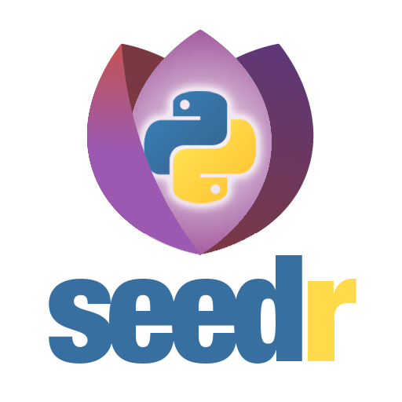

<p align="center">
  
</p>

<h1 align="center">seedrcc</h1>

<p align="center">
  <strong>A comprehensive Python API wrapper for seedr.cc.</strong>
</p>

<p align="center">
<a href="https://pypi.org/project/seedrcc">

</a>
<a href="https://pepy.tech/project/seedrcc">

</a>
<a href="https://github.com/hemantapkh/seedrcc/stargazers">

</a>
<a href="https://github.com/hemantapkh/seedrcc/issues">

</a>
</p>

---

**seedrcc** provides a clean Python interface for the Seedr API, with support for both synchronous and asynchronous operations.

## Features

- **Complete API Coverage:** All major Seedr API endpoints are supported.
- **Works for All Users:** Fully functional for both free and premium Seedr accounts.
- **Sync & Async:** Includes `seedrcc.Seedr` for synchronous operations and `seedrcc.AsyncSeedr` for asynchronous ones.
- **Robust Authentication:** Handles all authentication flows, including automatic token refreshes.
- **Fully Typed:** Provides type hints for all methods and models to improve code quality and clarity.
- **Custom Exceptions:** Provides specific exceptions for API, network, and authentication errors.
- **Dataclass Models:** API responses are parsed into clean, easy-to-use dataclasses.

## Installation

Install the library from PyPI using `pip` or your favorite package manager.

```bash
pip install seedrcc
```

Or, install the latest version directly from GitHub:

```bash
pip install git+https://github.com/hemantapkh/seedrcc.git
```

## Basic Usage

### Synchronous

```python
from seedrcc import Seedr

# Authenticate using your username and password
with Seedr.from_password("your_email@example.com", "your_password") as client:
    # Get your account settings
    settings = client.get_settings()
    print(f"Hello, {settings.account.username}!")
```

### Asynchronous

```python
import asyncio
from seedrcc import AsyncSeedr

async def main():
    # Authenticate using your username and password
    async with AsyncSeedr.from_password("your_email@example.com", "your_password") as client:
        # Get your account settings
        settings = await client.get_settings()
        print(f"Hello, {settings.account.username}!")

if __name__ == "__main__":
    asyncio.run(main())
```

## Authentication Methods

### Device Code Flow (Recommended)

This is the recommended authentication method as it provides a long-term session. The process involves three steps:

1.  **Get Device Code:** Use `Seedr.get_device_code()` to get the device and user codes.
2.  **Authorize:** Open the `verification_url` ([https://www.seedr.cc/devices](https://www.seedr.cc/devices)) in a browser and enter the `user_code`.
3.  **Create Client:** Once authorized, create the client using the `device_code`.

```python
from seedrcc import Seedr

# 1. Get the device and user codes from the API.
codes = Seedr.get_device_code()

# 2. Display the authorization details for the user to act on.
print(f"Please open this URL in your browser: {codes.verification_url}")
print(f"And enter this code: {codes.user_code}")
input("Press Enter after authorizing.")

# 3. Create the client using the device_code from the initial request.
with Seedr.from_device_code(codes.device_code) as client:
    settings = client.get_settings()
    print(f"Success! Hello, {settings.account.username}")
```

### Password Flow

You can also authenticate directly with your username and password, as shown in the Basic Usage examples.

## Saving and Reusing Your Session

To avoid logging in every time, you can save the `Token` object after your first authentication and reuse it.

The `Token` object has several methods to convert it for storage or use:

- [`token.to_json()`][seedrcc.token.Token.to_json]: Converts the token to a JSON string, perfect for saving in text files.
- [`token.to_base64()`][seedrcc.token.Token.to_base64]: Converts the token to a simple Base64 string, great for databases or environment variables.
- [`token.to_dict()`][seedrcc.token.Token.to_dict]: Converts the token to a Python dictionary for in-memory use.

You can then use the corresponding [`Token.from_...()`][seedrcc.token.Token.from_dict] method to load it back.

```python
from seedrcc import Seedr, Token

# Assume 'client' is an authenticated client from a previous session
# client = Seedr.from_password(...) or Seedr.from_device_code(...)

# 1. Get the token and convert it to a JSON string.
token = client.token
json_string = token.to_json()

# You would typically save this string to a file or database.

# --- In a new session ---

# 2. Load the token from the saved string.
reloaded_token = Token.from_json(json_string)

# 3. Initialize the client directly with the reloaded token.
with Seedr(token=reloaded_token) as new_client:
    settings = new_client.get_settings()
    print(f"Successfully re-authenticated as {settings.account.username}")
```

## Handling Token Refreshes

The client automatically handles token refreshes. However, if you load an old token when your program starts, the client must perform a refresh on the first API call, which adds a delay.

To avoid this, you can provide an `on_token_refresh` callback. This function is called whenever a refresh happens, giving you the new `Token` object so you can save it. By saving the new token, your program will start with a fresh token on its next run.

Your callback function will receive the new `Token` object as its first argument.

When using the `AsyncSeedr` client, you can provide an `async` function for the callback. If a regular synchronous function is provided instead, it will be safely executed in a separate thread.

**Callback with a single argument:**

```python
from seedrcc import Seedr, Token

def save_token(token: Token):
    # This function will be called whenever the token is refreshed.
    # You should save the new token data to your database or file.
    print(f"New token received: {token.access_token}")
    with open("token.json", "w") as f:
        f.write(token.to_json())

# When creating the client, pass the callback function.
client = Seedr.from_password("user", "pass", on_token_refresh=save_token)
```

**Callback with multiple arguments:**

If you need to pass additional arguments to your callback (like a user ID), you can use a `lambda` for a synchronous callback. For an `async` callback, the recommended approach is to use `functools.partial`.

```python
import functools
from seedrcc import AsyncSeedr, Seedr, Token

# Synchronous example with lambda
def save_token_for_user(token: Token, user_id: int):
    print(f"Saving new token for user {user_id}")
    # ... save to database ...

user_id = 123
client = Seedr.from_password(
    "user", "pass",
    on_token_refresh=lambda token: save_token_for_user(token, user_id)
)

# Asynchronous example with functools.partial
async def save_token_for_user_async(token: Token, user_id: int):
    print(f"Saving new token for user {user_id}")
    # ... save to database ...

user_id = 456
async_callback = functools.partial(save_token_for_user_async, user_id=user_id)
# async_client = await AsyncSeedr.from_password(
#     "user", "pass", on_token_refresh=async_callback
# )
```

## Next Steps

Ready to explore the full API? The reference documentation provides a complete guide to every available method, from adding torrents and managing files to checking your account details.

- **API Reference:**
  - [Synchronous Client](sync_client.md)
  - [Asynchronous Client](async_client.md)
  - [Data Models](models.md)
  - [Exceptions](exceptions.md)
- **License:** This project is licensed under the MIT License. See the `LICENSE` file for details.
- **Contributing:** Contributions are welcome! Please see the project on [GitHub](https://github.com/hemantapkh/seedrcc).